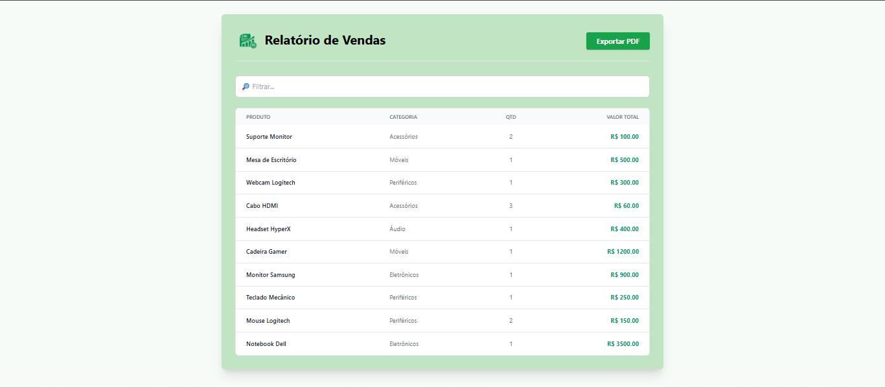
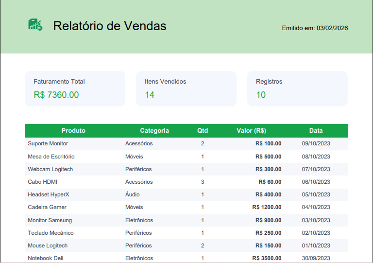

# 📊 Desafio Técnico - Visualizador de Relatórios de Vendas

Aplicação Full Stack desenvolvida como parte do desafio técnico para estágio. O sistema consiste em um dashboard para visualização de registros de vendas, permitindo filtragem avançada e exportação de relatórios em PDF.

## 📸 Screenshots

### 🖥️ Dashboard Web
> Interface responsiva com listagem de dados e filtros dinâmicos.


### 📄 Relatório PDF Gerado
> Exportação profissional com design customizado, cabeçalho e tabulação automática.


---

## 🚀 Tecnologias Utilizadas

### Backend
- **Node.js** & **Express**: Construção da API REST.
- **Prisma ORM**: Gerenciamento do banco de dados e migrações.
- **SQLite**: Banco de dados relacional (arquivo local).
- **CORS**: Gerenciamento de acessos externos.

### Frontend
- **React** (Vite): Biblioteca para construção da interface.
- **TypeScript**: Tipagem estática para maior segurança no código.
- **Tailwind CSS**: Estilização utilitária e responsiva.
- **Axios**: Consumo da API.
- **jsPDF & AutoTable**: Geração de documentos PDF no front-end.

---

## ⚙️ Instalação e Execução

Siga os passos abaixo para rodar o projeto localmente ou em ambiente de desenvolvimento (Codespaces).

### 1. Configurando o Backend (Servidor)

O backend roda na porta `3001`.

```bash
# Entre na pasta do servidor
cd server

# Instale as dependências
npm install

# Gere o banco de dados e as tabelas (Migração)
npx prisma migrate dev --name init

# Popule o banco com dados de teste (Seed)
node seed.js

# Inicie o servidor
node index.js

### 2. Configurando o Frontend (Cliente)

O frontend foi desenvolvido com Vite e roda na porta `5173`.

> **Importante:** Abra um **novo terminal** para rodar o frontend (mantenha o backend rodando no outro).

```bash
# Entre na pasta do cliente
cd client

# Instale as dependências (React, Tailwind, Axios, jsPDF)
npm install

# Inicie o servidor de desenvolvimento
npm run dev